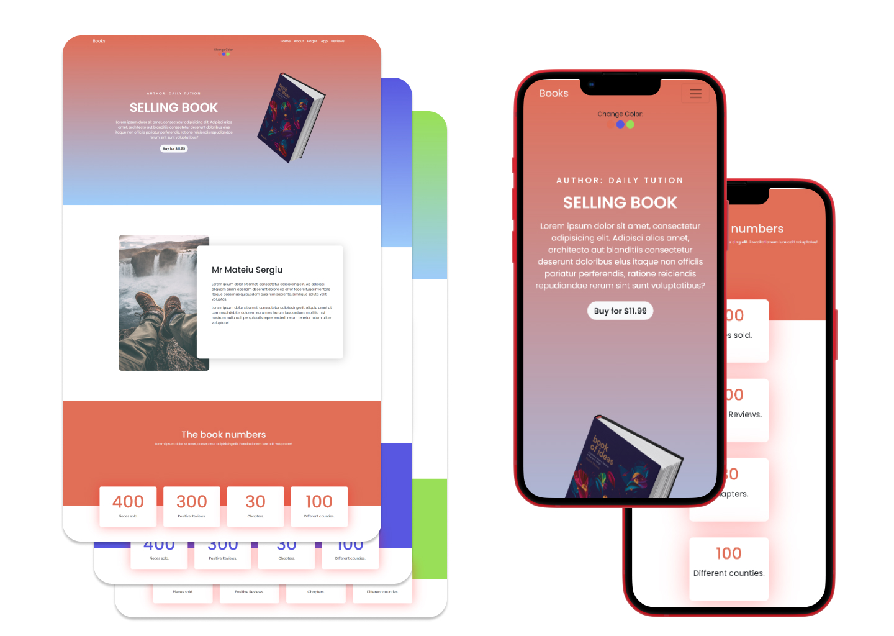
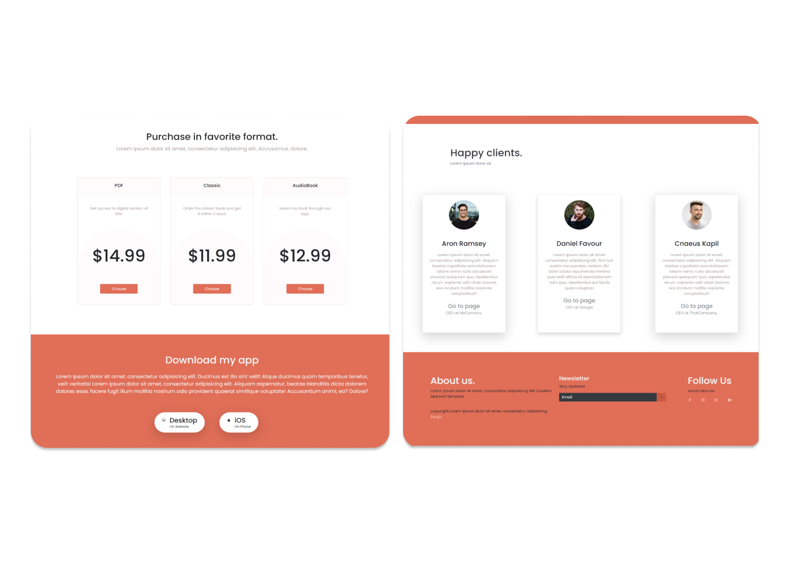

# :book: Responsive Book Website

- Follow tutorial on youtube. [link](https://www.youtube.com/watch?v=zhllkjYYUVE&t=4059s&ab_channel=DailyTuition)
- Responsive Book Website Concept Using HTML, CSS, Bootstrap & JavaScript
- Project made for practicing Bootstrap framework.
- Buttons to change background primary color.
- Compatible with all mobile devices and with a pleasant user interface.
- Well structured

